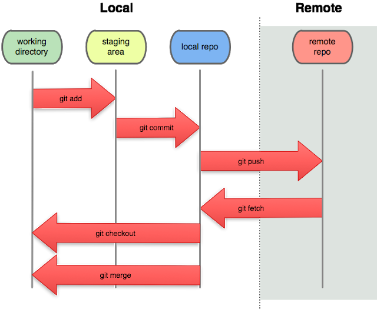

# Intro to @fa[git]
## August Guang

---

## What is @fa[git]?

@ul

 - open source version control tool written by Linus Torvalds (@fa[linux])
 - **version control:** tracks and manages changes to documents, computer programs, and other collections of information

@ulend

---

## Why use git?

 * Tracking changes over time
 * Helps with collaboration on the same software
 * Protect stable/production code from bugs

---

## Webhosts

@size[3.5em](@fa[gitlab])
@size[3.5em](@fa[github])
@size[3.5em](@fa[bitbucket])

---

## @fa[git] basics

 * **repository or repo:** where documents, software, etc is stored and the changes are tracked

```text
my_repo
├── python_code
|   ├── something.py
|   └── something_else.py
└── README.md

```

---

## Basic commands everyone should know

```bash
mkdir DIR # makes a directory (folder)
cd DIR # Go to created directory
```

Example:
```bash
cd my_repo
mkdir documentation
```

Result:
```text
my_repo
├── python_code
|   ├── something.py
|   └── something_else.py
├── documentation
└── README.md
```

---

```bash
git add FILE # add file contents to be ready to be committed
git commit FILE # commit file contents to the local repository
git commit -a -m "commit message" # commit all added/modified/deleted file contents with specific message
git push # push file contents to the remote (i.e. cloud) repository
```

Example
```text
 Local                    |	Remote
 ---                      | ---
 my_repo                  |  my_repo                  | 
 ├── python_code          |  ├── python_code          |
 |   ├── something.py     |  |   ├── something.py     |
 |   └── something_else.py|  |   └── something_else.py|
 ├── documentation        |  ├── documentation        |
 └── README.md            |  └── README.md
```


 * Note if you do not use `git commit -m "commit message"` you will be taken to a vim screen to make your edits. You should be able to get away with typing in `i` to insert, typing your message, then typing `:wq` to write and quit. If that doesn't work you probably did something complicated with vim, good luck!

---

### @fa[code-commit]

 * @fa[code-merge]
 * @fa[code-branch]

---

## What's actually happening with these commands?



---

## DO NOT DO THESE THINGS!!!

 * Commit large files to the repository. You can get rid of them but it is a real pain.

---

# git flows

## Branching

```
git branch # List all branches of local repository. The current branch is highlighted with an asterisk.
git checkout -b NEW_BRANCH # checks out a branch from the remote repository to local if it exists. If it does not exist, creates a new branch.
```

---

# fun things

---

## Slack @fa[slack] integration

 * Can subscribe a channel to a Github repository so everyone in the channel sees commits, pushes, etc and can comment on them

---

## gitpitch

 * This entire presentation was made in gitpitch with Markdown.
 * Syntax relatively similar to Beamer in LaTeX
 * Fun to make but would probably only use it for code heavy presentations...

---

## Other integrations: travis, codecov, notebooks

---

# Learn more

 * Generally stackoverflow.com is where I have acquired all of my git knowledge.