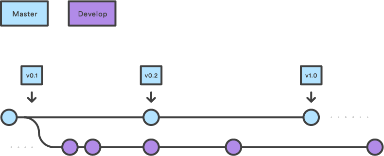
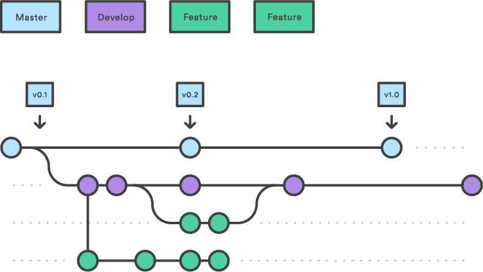
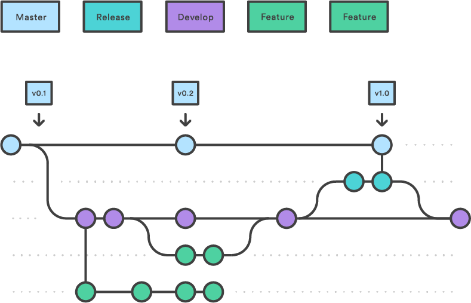
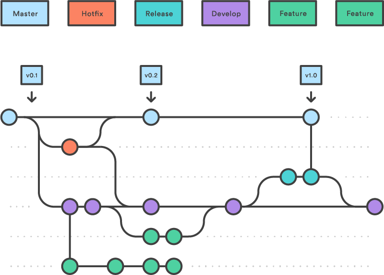

# Intro to @fa[git]
## August Guang

---

## What is @fa[git]?

@ul

 - open source version control tool written by Linus Torvalds (@fa[linux])
 - **version control:** tracks and manages changes to documents, computer programs, and other collections of information

@ulend

---

## Why use git?

@ul

 * Tracking changes over time
 * Helps with collaboration on the same software
 * Protect stable/production code from bugs

@ulend

---

## Webhosts

@size[3.5em][@fa[gitlab]](https://about.gitlab.com)
*Gitlab*
@size[3.5em][@fa[github]](https://github.com)
*Github*
@size[3.5em][@fa[bitbucket]](https://bitbucket.org)
*Bitbucket*

---

## @fa[git] basics

 * **repository or repo:** where documents, software, etc is stored and the changes are tracked

```text
my_repo
├── python_code
|   ├── something.py
|   └── something_else.py
└── README.md

```

---


@size[0.5em][https://hoantran-it.blogspot.com/2016/06/git-tutorial-1-git-committing-and.html](https://hoantran-it.blogspot.com/2016/06/git-tutorial-1-git-committing-and.html)


---

```bash
# check status of your git repo including what's changed
# and what's not being tracked
git status
# add file contents to be ready to be committed
git add FILE 
# commit file contents to the local repository
git commit FILE
# commit all added/modified/deleted file contents with
# specific message
git commit -a -m "commit message"
# push file contents to the remote (i.e. cloud) repository
git push 
```

+++

`git status` reveals items in documentation are not being tracked.

```diff
On branch master
Your branch is up to date with 'origin/master'.

Untracked files:
  (use "git add <file>..." to include in what will be committed)

	- documentation/
```

```text
Working Directory       | Local                   |	Remote
 ---                    | ---                     |
 my_repo                |  my_repo                |  my_repo 
 ├── python_code        |  ├── python_code        |  ├── python_code
 |   ├── something.py   |  |   ├── something.py   |  |   ├── something.py
 ├── documentation      |  └── README.md          |  └── README.md
 |   ├── something.txt  |                         |
 └── README.md          |                         |
```

+++

`git add documentation` adds everything in the `documentation` folder.

```bash
git add documentation
git status
```

```bash
On branch master
Your branch is up to date with 'origin/master'.

Changes to be committed:
  (use "git reset HEAD <file>..." to unstage)

	new file:   documentation/
```

```text
Working Directory       | Local                   |	Remote
 ---                    | ---                     |
 my_repo                |  my_repo                |  my_repo 
 ├── python_code        |  ├── python_code        |  ├── python_code
 |   ├── something.py   |  |   ├── something.py   |  |   ├── something.py
 ├── documentation      |  └── README.md          |  └── README.md
 |   ├── something.txt  |                         |
 └── README.md          |                         |
```

+++

`git commit -a -m "documentation folder"` actually commits it to local repo.

```bash
git commit -a -m "documentation folder"
git status
```

```text
On branch master
Your branch is up to date with 'origin/master'.
```

```text
Working Directory          | Local                      |	Remote
 ---                       | ---                        |
 my_repo                   |  my_repo                   |  my_repo 
 ├── python_code           |  ├── python_code           |  ├── python_code
 |   ├── something.py      |  |   ├── something.py      |  |   ├── something.py
 ├── documentation         |  ├── documentation         |  ├── documentation
 |   ├── something.txt     |  |   ├── something.txt     |  └── README.md 
 └── README.md             |  └── README.md             | 
```

+++

`git push origin master` pushes everything from the local repository to the remote repository.

```bash
git push origin master
git status
```

```text
On branch master
Your branch is ahead of 'origin/master' by 1 commit.
  (use "git push" to publish your local commits)
```


```text
Working Directory          | Local                      |	Remote
 ---                       | ---                        |
 my_repo                   |  my_repo                   |  my_repo 
 ├── python_code           |  ├── python_code           |  ├── python_code
 |   ├── something.py      |  |   ├── something.py      |  |   ├── something.py
 ├── documentation         |  ├── documentation         |  ├── documentation 
 |   ├── something.txt     |  |   ├── something.txt     |  |   ├── something.txt
 └── README.md             |  └── README.md             |  └── README.md
```

---


---

```bash
# pull data from remote repo into local repo
git fetch
# merges data from local repo into working directory
git merge
# used to navigate between branches on the local repo
# need to run git fetch first to pull in branches
git checkout BRANCH
# used to create a new branch
git checkout -b NEW_BRANCH
# tells you what branches you have locally and what
# branch your working directory is on
git branch
# combines fetch & merge all at once
git pull
```

+++

Original structure

```diff
+ remote
master                 | BRANCH                   
 ---                   | ---                       
 my_repo               |  my_repo                  
 ├── python_code       |  ├── python_code           
 |   ├── something.py  |  |   ├── something.py 
 ├── documentation     |  ├── LICENSE.txt     
 |   ├── something.txt |  └── README.md                                       
 └── README.md         |     

- local
master
 ---                                          
 my_repo                                 
 ├── python_code                 
 |   ├── something.py
 ├── documentation         
 |   ├── something.txt                               
 └── README.md          

- working directory
master
 ---                                          
 my_repo                                 
 ├── python_code                 
 |   ├── something.py                              
 └── README.md                
```


+++

`git fetch` pulls data from remote repo into local repo.

```diff
+ remote
master                 | BRANCH                    
 ---                   | ---                       
 my_repo               |  my_repo                  
 ├── python_code       |  ├── python_code           
 |   ├── something.py  |  |   ├── something.py 
 ├── documentation     |  ├── LICENSE.txt     
 |   ├── something.txt |  └── README.md                                       
 └── README.md         |     

- local
master                 | BRANCH                    
 ---                   | ---                       
 my_repo               |  my_repo                  
 ├── python_code       |  ├── python_code           
 |   ├── something.py  |  |   ├── something.py 
 ├── documentation     |  ├── LICENSE.txt     
 |   ├── something.txt |  └── README.md                                       
 └── README.md         |     

- working directory
master
 ---                                          
 my_repo                                 
 ├── python_code                 
 |   ├── something.py                              
 └── README.md                
```

+++

`git merge` merges everything from local current branch into working directory.

```diff
+ remote
master                 | BRANCH                    
 ---                   | ---                       
 my_repo               |  my_repo                  
 ├── python_code       |  ├── python_code           
 |   ├── something.py  |  |   ├── something.py 
 ├── documentation     |  ├── LICENSE.txt     
 |   ├── something.txt |  └── README.md                                       
 └── README.md         |     

- local
master                 | BRANCH                    
 ---                   | ---                       
 my_repo               |  my_repo                  
 ├── python_code       |  ├── python_code           
 |   ├── something.py  |  |   ├── something.py 
 ├── documentation     |  ├── LICENSE.txt     
 |   ├── something.txt |  └── README.md                                       
 └── README.md         |     

- working directory
master
 ---                                          
 my_repo                                 
 ├── python_code                 
 |   ├── something.py
 ├── documentation         
 |   ├── something.txt                                
 └── README.md                
```

+++

`git checkout BRANCH` now pulls in everything from local BRANCH into working.

```diff
+ remote
master                 | BRANCH                    
 ---                   | ---                       
 my_repo               |  my_repo                  
 ├── python_code       |  ├── python_code           
 |   ├── something.py  |  |   ├── something.py 
 ├── documentation     |  ├── LICENSE.txt     
 |   ├── something.txt |  └── README.md                                       
 └── README.md         |     

- local
master                 | BRANCH                    
 ---                   | ---                       
 my_repo               |  my_repo                  
 ├── python_code       |  ├── python_code           
 |   ├── something.py  |  |   ├── something.py 
 ├── documentation     |  ├── LICENSE.txt     
 |   ├── something.txt |  └── README.md                                       
 └── README.md         |

- working directory
BRANCH
 ---                                          
 my_repo                                 
 ├── python_code                 
 |   ├── something.py
 ├── LICENSE.txt                           
 └── README.md                
```

+++

`git checkout -b NEW_BRANCH` creates a new branch locally and switches the working directory over.

```diff
+ remote
master                 | BRANCH                    
 ---                   | ---                       
 my_repo               |  my_repo                  
 ├── python_code       |  ├── python_code           
 |   ├── something.py  |  |   ├── something.py 
 ├── documentation     |  ├── LICENSE.txt     
 |   ├── something.txt |  └── README.md                                       
 └── README.md         |     

- local
master                 | BRANCH                 | NEW_BRANCH   
 ---                   | ---                    | ---   
 my_repo               |  my_repo               | my_repo   
 ├── python_code       |  ├── python_code       | ├── python_code      
 |   ├── something.py  |  |   ├── something.py  | |   ├── something.py
 ├── documentation     |  ├── LICENSE.txt       | ├── LICENSE.txt   
 |   ├── something.txt |  └── README.md         | └── README.md                                    
 └── README.md         |

- working directory
NEW_BRANCH
 ---                                          
 my_repo                                 
 ├── python_code                 
 |   ├── something.py
 ├── LICENSE.txt                           
 └── README.md                
```

+++

`git branch` tells you what branch you are on

```bash
git branch
* NEW_BRANCH
  master
```

+++

Note: when pushing changes from `NEW_BRANCH` to remote for first time, you must use `git push origin NEW_BRANCH` in order to set a new (upstream) remote branch. Otherwise you will get this error:

```diff
git push
fatal: The current branch NEW_BRANCH has no upstream branch.
To push the current branch and set the remote as upstream, use

    git push --set-upstream origin NEW_BRANCH
```

---

# @fa[git] workflows

---

## gitflow

+++


@size[0.5em][https://www.atlassian.com/git/tutorials/comparing-workflows/gitflow-workflow](https://www.atlassian.com/git/tutorials/comparing-workflows/gitflow-workflow)

+++



+++



+++



---

## github flow

[https://guides.github.com/introduction/flow/](https://guides.github.com/introduction/flow/)

---

# fun things

---

## Slack @fa[slack] integration

@ul

 * Can subscribe a channel to a Github repository so everyone in the channel sees commits, pushes, etc and can comment on them
 * Useful for individual projects

@ulend

---?code=src/gitpitch.md

---

## Other integrations: travis, codecov, notebooks

[http://github.com/aguang/transmissim](http://github.com/aguang/transmissim)

---

# Learn more

 * Generally @fa[stack-overflow](http://www.stackoverflow.com) is where I have acquired all of my git knowledge.
 * Atlassian also has [great explanations of everything](https://www.atlassian.com/git/tutorials/using-branches/git-checkout)